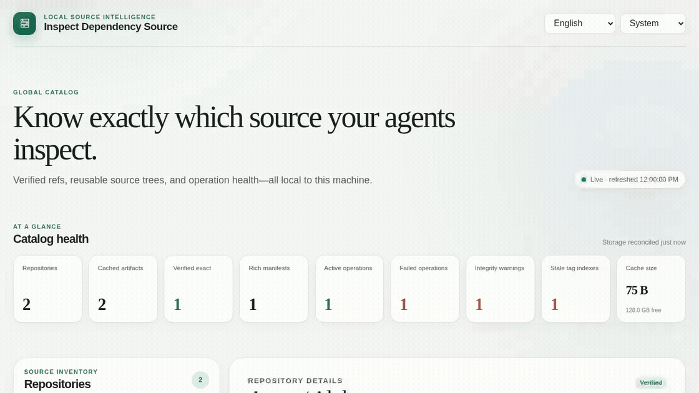
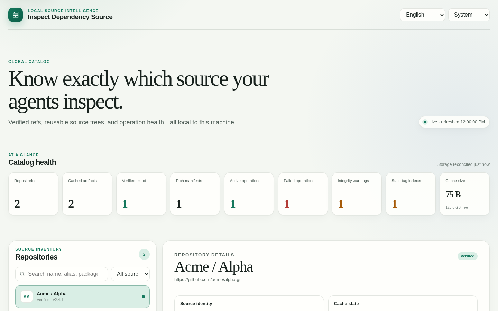

# Inspect Dependency Source

[English](README.md)

[](https://github.com/Tairitsua/inspect-dependency-source-skill/actions/workflows/release-readiness.yml)
[](SKILL.md)
[](https://skills.sh/tairitsua/inspect-dependency-source-skill)
[](LICENSE)

> 检查项目实际使用的准确依赖源码，并证明它来自哪个 commit。

编码 Agent 往往很擅长理解当前仓库，但一旦跨过第三方依赖边界，可靠性就会明显下降：它可能查看上游最新分支而不是项目实际使用的版本；在多个工作区反复下载同一份大型源码；丢失包版本与源码提交之间的关联；或者只依赖无法解释实现细节的文档。

Inspect Dependency Source 是一个用户级 Agent Skill，内置由同一台机器上所有项目和编码 Agent 共享的源码目录。它将依赖解析到可复用的本地源码树，记录每个版本的选择依据，在准确 ref 不存在时明确失败，并将结果变成一张适合分享的 Source Receipt（源码凭证）。

它不会让模型本身变得更聪明，而是建立一条可检查的证据链：包或 ref → 仓库 → commit → 已验证本地源码 → 明确结论边界的凭证。

[看证据](#一张凭证把证据讲清楚) · [安装](#30-秒安装) · [第一句话](#第一句话) · [安全边界](#安全边界与隐私) · [验证](#开发)

## 一张凭证把证据讲清楚

一次真实的 [`Newtonsoft.Json 13.0.3`](examples/newtonsoft-json-13.0.3/README.md) 回放得到：

> **PROVEN — exact commit.** The request resolved to an immutable commit, and the cached source passed integrity verification at that commit.

`NuGet · Newtonsoft.Json 13.0.3` → `JamesNK/Newtonsoft.Json` → `0a2e291c0d9c`

[完整 Source Receipt](examples/newtonsoft-json-13.0.3/source-receipt.md)记录预期 commit、实际 commit、来源类别、完整性状态与验证时间。它默认隐藏绝对路径、远程 URL、别名、目录内部 ID 和从本地路径派生的身份后缀。



*可复现的浏览器回放：包身份 → 准确 commit → 始终明确阻断的完整性错误。*



*只读的 localhost 仪表盘让源码清单、准确版本依据和操作健康状态始终可见，且不暴露任何变更控件。*

## 解决的问题

- **准确版本调试：** 将包版本或指定 ref 绑定到 tag 或 commit，绝不静默替换为默认分支。
- **可复用的源码上下文：** 下载一次后，即可由 Codex、Claude 及不同仓库复用同一份已验证源码。
- **Source Receipt：** 将包/ref 的来源依据变成可复制的证据卡，清楚区分已证明、候选和阻断三种结论。
- **更安全的缓存：** 在临时目录下载并验证后原子提升；替换失败时保留上一份可用版本。
- **本地可观测性：** 通过可离线使用的仪表盘查看仓库、工件、包绑定、时效性、完整性、磁盘占用和操作历史。
- **无需耦合内部实现的自动化：** 通过稳定的 `resolve --json` 契约集成，无需直接读取存储文件。

运行时仅使用 Python 标准库。访问公开 Git 和 GitHub 仓库不强制依赖 GitHub CLI。

## 不只获取源码，更要留下证据

[opensrc](https://github.com/vercel-labs/opensrc) 面向多个包生态提供便捷的源码获取与缓存；[Context7](https://context7.com/docs/overview) 提供版本相关的文档和示例。它们都很有用，也都可以与本项目配合使用。

Inspect Dependency Source 聚焦一个更窄的信任问题：*这项分析能否证明，被检查的源码树真的对应用户请求的依赖或 ref？*

| 需求 | opensrc | Context7 | Inspect Dependency Source |
| --- | --- | --- | --- |
| 主要结果 | 已缓存源码路径 | 文档与示例 | 已验证源码 + Source Receipt |
| 典型问题 | “这个包的源码在哪里？” | “这个 API 应该如何使用？” | “哪个 commit 能证明这个依赖行为？” |
| 请求的 ref 不存在 | [可能回退到默认分支](https://github.com/vercel-labs/opensrc/blob/f96078ac0a7ce3fb7d058d73ce65ff4b6606d765/packages/opensrc/cli/src/core/git.rs#L95-L127) | 不负责解析源码树 | 明确失败 |
| 证据边界 | 面向包/版本的缓存条目 | 文档版本 | 预期 commit、实际 commit、来源类别、完整性 |
| 离线复用 | 已缓存源码 | 取决于集成方式 | 共享本地目录 |

Inspect Dependency Source 不替代通用源码获取或文档检索。它的差异在于保守地证明关系：启发式映射只能是候选，未解析关系会阻断准确版本结论，而准确证据必须在 commit 层面一致。

## 支持的源码类型

- GitHub 仓库。
- 通用 Git 远程仓库。
- 已存在的本地源码树。
- 准确的 NuGet 包版本；当包元数据提供仓库 commit 时，优先保留该来源依据。

首个版本不包含 npm、PyPI、Maven 和 Cargo 包解析器，但仍可通过 Git 或本地源码方式注册这些包的仓库。

## 30 秒安装

按当前 OS 用户安装一次，让所有项目都能调用同一个 Skill：

```bash
npx skills add Tairitsua/inspect-dependency-source-skill --global
```

如需只在当前项目安装，请去掉 `--global`。公开包只包含一个 Skill，也可在 [skills.sh](https://skills.sh/tairitsua/inspect-dependency-source-skill) 查看。

Claude Code marketplace 安装方式：

```bash
claude plugin marketplace add Tairitsua/inspect-dependency-source-skill
claude plugin install inspect-dependency-source@inspect-dependency-source
```

### 第一句话

安装后直接对 Agent 说：

```text
Use the inspect-dependency-source skill to resolve Newtonsoft.Json 13.0.3,
inspect the exact source used by that package, and include a Source Receipt.
```

### 手动共享 checkout

如果无法使用 `npx`，可将主 checkout 放在 Codex 用户级 Skill 目录，再让 Claude 链接到同一份内容：

```bash
mkdir -p "$HOME/.agents/skills" "$HOME/.claude/skills"
git clone https://github.com/Tairitsua/inspect-dependency-source-skill.git \
  "$HOME/.agents/skills/inspect-dependency-source"
ln -s "$HOME/.agents/skills/inspect-dependency-source" \
  "$HOME/.claude/skills/inspect-dependency-source"
```

- Codex 用户级 Skill：`$HOME/.agents/skills/inspect-dependency-source`
- Claude 用户级 Skill：`~/.claude/skills/inspect-dependency-source`

如果环境不支持符号链接，也可以分别将仓库 clone 或复制到两个目录。运行时目录与安装目录、当前项目相互独立，因此所有安装仍会共享同一个用户级源码目录。

环境要求：

- Python 3.11 或更高版本，并包含标准 `sqlite3` 模块。
- 处理 Git 仓库的注册和下载时需要 Git。
- 只有远程刷新、下载或 NuGet 解析需要网络。
- 私有 GitHub 仓库或更高 API 限额可选用 `gh`、`GH_TOKEN` 或 `GITHUB_TOKEN`。

## 快速开始

从已安装的 Skill 目录运行命令：

```bash
cd "$HOME/.agents/skills/inspect-dependency-source"

# 创建全局目录，并启动或复用仪表盘。
python3 scripts/inspect_dependency_source.py init

# 检查本地 Git、GitHub 认证和运行时前置条件（不会探测网络）。
python3 scripts/inspect_dependency_source.py doctor

# 缓存一个准确源码 ref。
python3 scripts/inspect_dependency_source.py repo add-github owner/repository --alias example
python3 scripts/inspect_dependency_source.py repo fetch example --ref v1.2.3

# 获取供 Agent 使用的稳定机器可读证据。
python3 scripts/inspect_dependency_source.py resolve example --ref v1.2.3 --json

# 为分析结论生成适合分享的 Markdown 证据。
python3 scripts/inspect_dependency_source.py resolve example --ref v1.2.3 --receipt

# 输出当前 localhost 仪表盘地址。
python3 scripts/inspect_dependency_source.py dashboard status
```

处理准确 NuGet 依赖：

```bash
python3 scripts/inspect_dependency_source.py package fetch-nuget Package.Id 1.2.3
python3 scripts/inspect_dependency_source.py resolve Package.Id --ref 1.2.3 --json
python3 scripts/inspect_dependency_source.py resolve Package.Id --ref 1.2.3 --receipt
```

注册已经存在的本地源码：

```bash
python3 scripts/inspect_dependency_source.py repo add-local /absolute/path/to/source --alias example
python3 scripts/inspect_dependency_source.py resolve example --json
```

所有命令请参阅 [CLI 参考](references/cli.md)；准确 ref、NuGet、本地、离线和恢复流程请参阅[源码检查工作流](references/workflows.md)。

## 触发示例

- “为什么 Newtonsoft.Json 13.0.3 内部会这样运行？”
- “调试前先把这个 SDK tag 解析到准确 commit。”
- “缓存这份依赖源码，让其他 Agent 也能复用。”
- “证明这项结论基于哪个源码版本。”
- “展示共享依赖源码目录和完整性告警。”
- “注册这个本地 checkout，但不要复制或修改它。”

## 仪表盘

除非指定 `--no-dashboard`，`init` 会为当前全局目录启动或复用一个仪表盘。也可单独管理：

```bash
python3 scripts/inspect_dependency_source.py dashboard start
python3 scripts/inspect_dependency_source.py dashboard status
python3 scripts/inspect_dependency_source.py dashboard stop
```

响应式只读 UI 展示：

- 仓库、工件、包绑定和验证数量。
- 支持搜索的源码清单、别名和已清理敏感信息的远程地址。
- 准确 ref/commit 来源以及首选源码路径。
- 已缓存 tag、本地 Git 快照、manifest 和新鲜度。
- 正在执行或失败的操作及可展开事件时间线。
- 完整性告警、缓存磁盘占用和剩余空间。

UI 支持英文与简体中文、跟随系统的亮/暗色主题、减少动态效果、键盘操作，以及 360/768/1440 像素响应式布局。语言、主题、筛选条件、选中仓库和展开的时间线会在两秒刷新周期中保持不变。

服务只绑定 `127.0.0.1`，不加载 CDN 资源，不启用 CORS，仅开放 GET/HEAD，也不提供下载、删除或其他写操作控件。

## Agent 如何使用

`SKILL.md` 指导 Agent 先解析、后下载，将 `resolve --json` 作为稳定的本地集成契约，并为依赖源码支撑的结论附上 `resolve --receipt` 证据。JSON 包含仓库、请求版本或 ref、选中工件、已解析 commit、验证状态、源码路径、包来源关系以及确定性的失败信息；凭证则把同一份证据投影为更适合分享的 Markdown。准确 JSON 字段、错误、增强 manifest 和操作事件请参阅[公共数据契约](references/schema.md)。

源码目录提供的是证据，并不会自动成为结论。Agent 应当：

1. 匹配项目实际解析出的依赖版本。
2. 优先使用 `exact_commit` 或 `exact_tag`。
3. 将 `heuristic_tag` 视为需要进一步验证的线索。
4. 当指定 ref 不存在时停止，不要分析其他分支。
5. 在分析结果中注明 ref、commit、来源类别和路径。
6. 当结论依赖已解析源码证据时附上 Source Receipt。
7. 将托管源码视为只读内容，因为其他项目和 Agent 会共同复用。

## 全局目录位置

按以下优先级选择当前目录：

1. 单次命令使用的 `--catalog-root <absolute-path>`。
2. `INSPECT_DEPENDENCY_SOURCE_HOME`。
3. `config set-root` 保存的路径。
4. 操作系统标准用户数据目录。

默认数据目录在 Linux 上是 `${XDG_DATA_HOME:-$HOME/.local/share}/inspect-dependency-source`，在 macOS 上是 `~/Library/Application Support/Inspect Dependency Source`，在 Windows 上是 `%LOCALAPPDATA%\Inspect Dependency Source`。

```bash
python3 scripts/inspect_dependency_source.py config show
python3 scripts/inspect_dependency_source.py config set-root /absolute/path/to/catalog
```

修改设置不会迁移现有数据。运行时目录绝不会根据 Skill 安装目录或当前项目推断。

请选择专用目录作为目录根路径。文件系统卷根目录以及包含无关文件的目录会被拒绝；在 POSIX 系统上，所选目录将由本工具管理并设为 `0700` 权限。

元数据存储在启用 WAL 模式的 SQLite 中。托管压缩包、临时下载、已提升源码树、操作锁、仪表盘进程元数据以及已缓存的核对指标都位于同一目录下。仓库、本地源码、工件、包绑定、tag、操作和事件分别建模。使用方必须通过 CLI 或只读仪表盘 API 集成，不能依赖内部 schema。

存储模型、HTTP 端点、事务式工件处理和安全边界请参阅[架构与安全](references/architecture.md)。

## 安全边界与隐私

- 不收集遥测数据。
- 目录元数据和源码树保留在用户本机。
- 在 POSIX 系统上，目录权限限制为仅当前用户可访问（`0700`），目录状态文件使用仅所有者可读写权限（`0600`）。
- 只有显式执行 GitHub 注册、远程元数据刷新、源码下载或包解析时才会产生出站流量。
- 远程地址在持久化和展示前会移除凭据；错误、事件、JSON 和 API 输出也会脱敏。
- 解压过程拒绝路径穿越、符号链接逃逸、过多成员和过大体积。
- 托管删除操作会检查路径范围，绝不删除用户注册的本地源码树。
- 仪表盘不暴露任意源码文件、环境变量、机密或写操作端点。
- 执行任何 `repo remove` 前，Agent 必须先展示准确仓库、托管工件和已注册本地源码，并暂停等待明确授权。执行时只能使用预览返回的准确仓库 ID 与计划令牌；待删除集合或可见计划一旦变化，就必须重新预览并重新授权。完成后还要确认所有原本存在的保留路径仍然存在。只有用户另外明确同意清理托管缓存后，才允许使用带 `--yes` 的清理命令。

仅限 localhost 并不代表可以安全公开。分享日志或仪表盘画面前，请检查仓库名、本地路径、包版本和操作历史。

Source Receipt 比原始 JSON 更适合分享，因为它会隐藏本地路径、远程地址、别名、内部 ID 和从本地路径派生的身份后缀。仓库名与包名仍可能敏感，公开前必须检查。

## 仓库结构

| 路径 | 用途 |
| --- | --- |
| `SKILL.md` | Agent 触发条件、工作流、证据规则和破坏性操作暂停点。 |
| `scripts/` | 仅依赖标准库的 CLI、目录、provider、仪表盘和凭证实现。 |
| `references/` | CLI、公共 schema、架构和 provider 工作流契约。 |
| `examples/` | 可复现的真实依赖证据与已提交产物。 |
| `showcase/` | 确定性 demo fixture、录制器和重录说明。 |
| `assets/dashboard/` | 离线仪表盘 HTML、CSS 和 JavaScript。 |
| `tests/` | 单元、集成、安全、凭证与真实浏览器验证。 |

## 开发

运行时代码必须保持仅依赖 Python 标准库；开发与浏览器验证可以使用可选工具。

```bash
# 标准库单元与集成测试。
python3 -m unittest discover -s tests -p 'test_*.py' -v

# 验证 Skill 元数据与结构。
python3 /path/to/skill-creator/scripts/quick_validate.py .

# 验证发布元数据、文档链接、隐私、CI 与展示素材。
python3 scripts/validate_release.py

# 可选浏览器验证（先执行 `pip install playwright` 和
# `playwright install chromium`）。
python3 tests/browser_validation.py
```

浏览器测试应覆盖：双语状态持久化、仓库切换、增量操作时间线、响应式布局、系统主题、可访问性、安全响应头，以及控制台和网络错误。

发布前请确认：完整测试套件和 Skill 验证已通过；工作树干净；安装到 Codex 与 Claude 的副本都通过同一套 Skill 验证。

发布记录见 [CHANGELOG.md](CHANGELOG.md)，发布叙事见 [v1.0.0 草案](docs/release-notes/v1.0.0.md)。

## 致谢

- 跨 Agent 包结构遵循 [Agent Skills specification](https://agentskills.io/specification)。
- [opensrc](https://github.com/vercel-labs/opensrc) 是通用包源码获取的重要参考。
- [Context7](https://context7.com/docs/overview) 可补充版本相关文档与示例。
- Claude marketplace 结构参考 [Anthropic 公开 Agent Skills marketplace](https://github.com/anthropics/skills/blob/main/.claude-plugin/marketplace.json)。

## 许可证

[MIT](LICENSE) © 2026 Momean。
